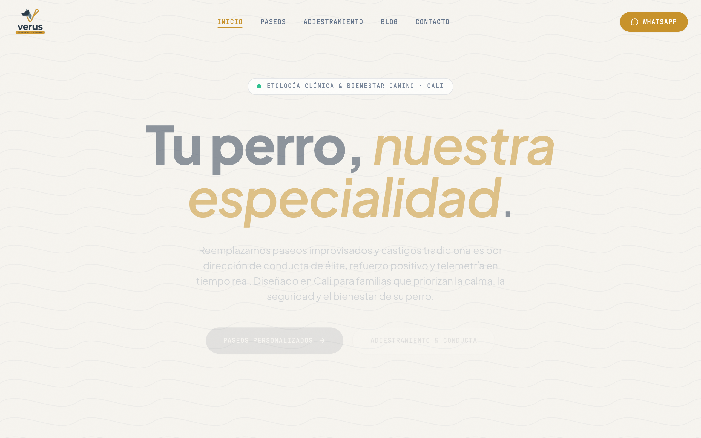

<div align="center">
  
</div>

<br />

<div align="center">

[](https://www.upwork.com)
&nbsp;
[](mailto:betovittoria@gmail.com)
&nbsp;
[](#05--inquiries--client-engagements)

</div>

---

###  01 // Architectural Philosophy

> *"Code without architectural understanding is just technical debt waiting to happen. Build on solid foundations: clean component separation, strict standards, and relentless performance."*

I engineer **high-converting web applications, resilient frontend architectures, and autonomous agentic workflows**. The core objective is balancing high-end aesthetic precision (Linear & Vercel design standards) with robust software engineering foundations:

* **Component-Driven & Decoupled Architecture:** Strict separation between presentation layers and domain logic.
* **Relentless Performance & Core Web Vitals:** Sub-second TTFB, optimized asset delivery, and zero-bloat runtime dependencies.
* **Spec-Driven Development (SDD):** Engineering through explicit specification, continuous validation, and atomic units of delivery.

---

###  02 // Featured Production Systems & Case Studies

#### Spotlight: Verus Web — Canine Behavioral Platform
> Production case study: high-ticket service funnel built with Next.js, Tailwind CSS, and mobile-first architectural rigor.

<div align="center">
  <a href="https://verusdogs.com">
    
  </a>
</div>

<br />

| Architectural Dimension | Engineering & Business Specification |
| :--- | :--- |
| **Live Production** | [verusdogs.com ↗](https://verusdogs.com) (Deployed via Vercel Edge Network) |
| **Frontend Architecture** | Next.js (App Router), React, Tailwind CSS, Component-Driven Design System |
| **Performance & CWV** | Sub-second First Contentful Paint, optimized SVG topographic backgrounds, zero CLS |
| **Conversion Strategy** | High-ticket clinical ethology consultation funnel with WhatsApp telemetry routing |

<br />

#### Production Systems Matrix

| System | Architecture & Stack | Focus & Highlights | Deployment |
| :--- | :--- | :--- | :--- |
| **Verus Web** | `Next.js` `React` `Tailwind` `Vercel` | **Canine Education & Behavioral Platform.** High-ticket conversion funnel, mobile-first responsive design, dynamic media optimization, and robust SEO architecture. | [verusdogs.com ↗](https://verusdogs.com) |
| **Landing Foundry** | `React` `Vite` `Framer Motion` `Tailwind` | **Multi-Theme High-Conversion Landing Factory.** Decoupled JSON data architecture, runtime semantic CSS token engine, and 60fps GPU-accelerated motion layers. | [Source & Demo ↗](https://github.com/betovittoria/landing-foundry) |
| **Victoria Studio** | `Astro` `TypeScript` `Tailwind` | **Ultra-Fast Editorial Web Experience.** Content-driven static architecture, zero-JS defaults for instant page loads, and modern typography hierarchy. | [Source Architecture ↗](https://github.com/betovittoria/victoria-studio) |
| **Habit Tracker OS** | `JavaScript` `Node.js` `SQLite` `PWA` | **Local-First Personal Operating System.** Offline-first reactive state management, persistent SQLite storage, and mobile touch interactions. | [Source Architecture ↗](https://github.com/betovittoria/habit_tracker_betovittoria) |

---

###  03 // Technical Matrix

#### **Frontend & UI Engineering**
```
React 19  ·  Next.js (App Router)  ·  Astro  ·  TypeScript  ·  Tailwind CSS  ·  Framer Motion  ·  Vite
```

#### **Backend, Data & Infrastructure**
```
Node.js  ·  SQLite  ·  Supabase / PostgreSQL  ·  REST APIs  ·  Linux (Termux/Debian)  ·  Git & GitHub Actions
```

#### **Architecture & Standards**
```
SOLID Principles  ·  Spec-Driven Development (SDD)  ·  Atomic Design  ·  Performance Optimization (CWV)
```

---

###  04 // Engineering Metrics

<div align="center">
  
  &nbsp;&nbsp;
  
</div>

---

###  05 // Inquiries & Client Engagements

Available for selective client contracts, frontend architecture modernization, and high-conversion web builds.

* **Inquiries:** [betovittoria@gmail.com](mailto:betovittoria@gmail.com)
* **Contracting:** Direct contracts & Upwork engagements
* **Timezone:** Remote · Worldwide (UTC-5)
